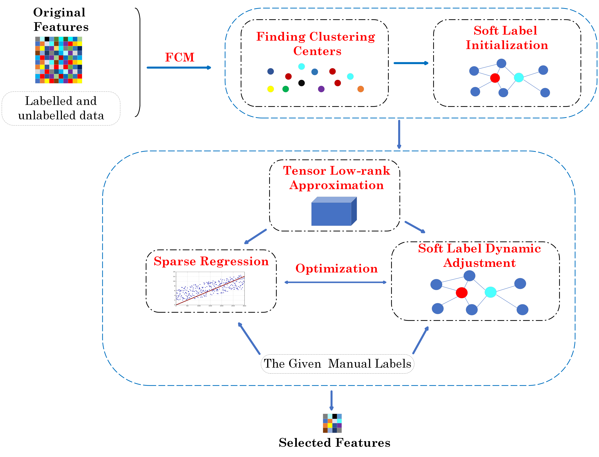

<h1 align="center">
    Multi-view semi-supervised feature selection with soft label learning and tensor low-rank approximation

 

</h1>

- We introduce soft label learning into semi-supervised feature
  selection and propose a unified framework that simultaneously
  performs soft label learning and feature selection. Besides, labelled
  and unlabelled data are exploited together using manual labels as the
  soft label learning guidance with a simple label propagation method.
- By separating the process of constructing the initial soft label from
  the entire framework, our method eliminates the time consumption
  of updating clustering centers and distances, and significantly
  reduces the overall computation complexity.
- Capturing consistency in multiple views better by introducing
  soft-label tensor kernel norm constraints.
- Experiments on the standard benchmarks demonstrate the
  state-of-the-art performance of the proposed method.

